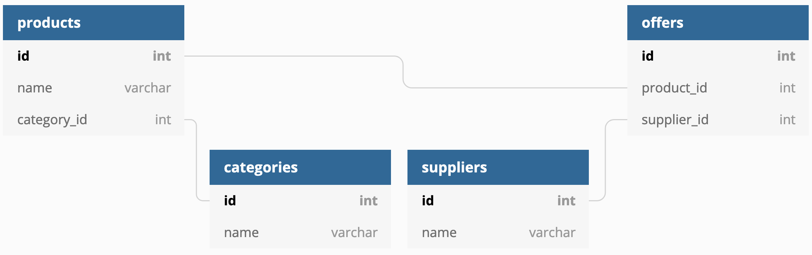

# Relayr challenge

This is an implementation of a service asked for in the application process to [Relayr]. See the 
[requirements PDF](docs/Back%20End%20:%20Data%20Engineer%20-%20Test%20Task%2010.2020.pdf) for details. 

## Assumptions
This is a recruiting task, so I'm making a couple of assumptions that simplify the implementation. 

- Names of products in a category are unique. If two products have the same name and category, they're identical.
- Supplier names are unique.

This means I can store all offers in one table. In a real-world implementation, the database schema would look something
[like this](https://dbdiagram.io/d/5f818af93a78976d7b771a06): 


## API documentation
The API documentation can be found in the file [`openapi.yaml`](api/openapi.yaml) in the OpenAPI 3.0 format. A rendered, 
dependency-free HTML version exists in [docs/html/index.html](docs/html/index.html).

The documentation can be rebuilt with the following command. It requires the 
[OpenAPI generator](https://openapi-generator.tech/docs/installation).

```shell script
openapi-generator generate -i api/openapi.yaml -g html2 -o docs/html
``` 

## Prerequisites and setting up the build environment
This project uses Go modules. As such, all you need is a recent version of Go (`1.14+`) installed. Dependencies will be 
automatically installed when `go build` is called (e.g. as part of `make build`). Details about all `make` targets can
be found in [its own section below](#available-make-targets).

If you'd like to build a Docker image, you'll also need [Docker](https://docker.com). 

## Running the service
There are two ways to run the service:
- `make run` will bring up the service
- `make build` will compile a binary which can be run separately

To run the server:

```
make run
```

You should see:

```
$ make run
(...)
2020/10/09 18:02:21 Serving on port 8080
```

If this worked, you can navigate to http://localhost:8080/ and see a welcome message from Go.

## Available Make targets

The makefile contains shortcuts for common commands:

 - `make compile` compiles everything, but doesn't create an executable
 - `make build` creates an executable
 - `make run` runs the server
 - `make deps` fetches and installs all dependencies
 - `make updatedeps` updates all dependencies to their latest versions. Updates `go.mod`.
 - `make golint` runs Golint on all source files
 - `make govet` runs `go vet` on all source files
 - `make goimports` runs `goimports` on all source files, updating them in-place
 - `make goimports-check` runs `goimports` on all source files, but returns a non-0 exit code when changes are required
 - `make tidy` runs `go mod tidy`, removing all unnecessary dependencies
 - `make tidy-check` checks if `go mod tidy` has been run (useful to fail a CI step)
 - `make checks` runs all linters and checks, specifically: `golint`, `goimports-check`, `govet`, `tidy-check` 
 - `make test` runs the tests
 - `make test-coverprofile` runs the tests and creates a coverage profile
 - `make coverage` runs the tests and creates an HTML coverage report
 - `make bench` runs the benchmark tests
 - `make clean` deletes the binary and report files

## Building a Docker image

The project comes with a `Dockerfile` which can be used to build an image, for example using the following command:
```shell script
docker build -t relayr-challenge .
```

To start the service in a Docker container, run the following command:
```shell script
docker run -p 8080:8080 relayr-challenge
```

The service will then be available at http://localhost:8080.

[Relayr]: https://relayr.io
